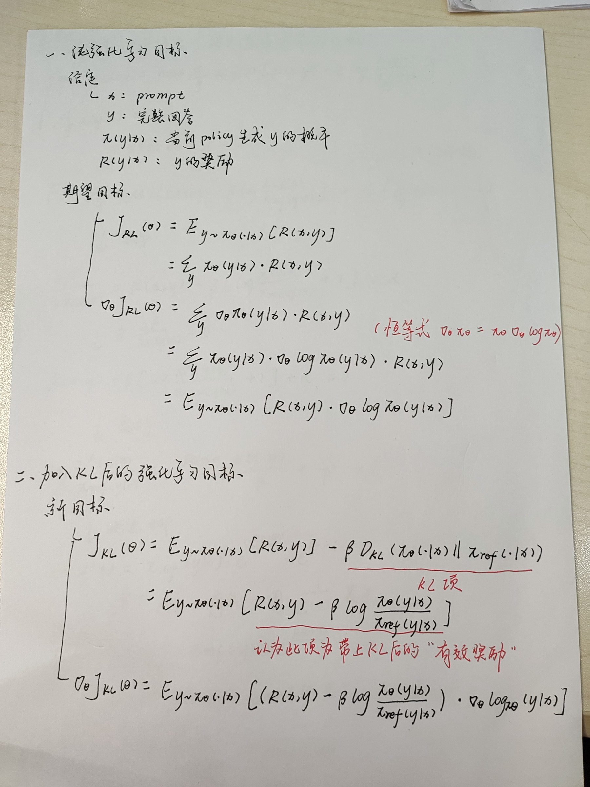
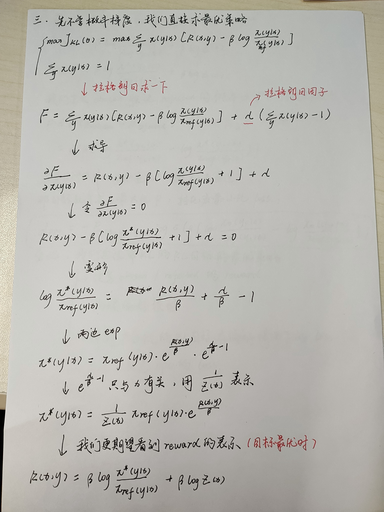
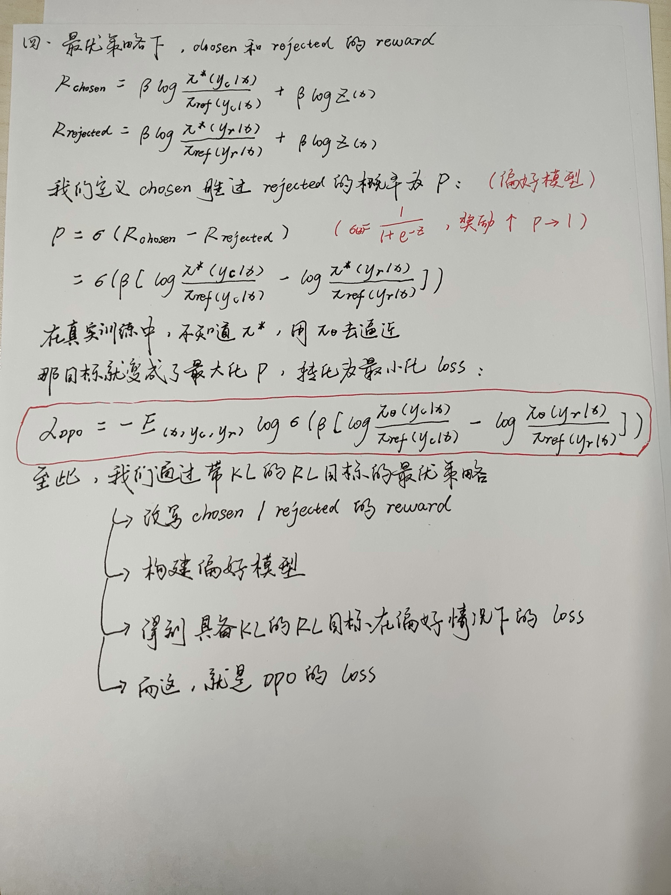

# DPO 为什么只做偏好分类，却“自带” KL 约束？

> 更喜欢手写体的可以看手稿。下面三页是我下午完整手推的过程，展开即可查看。

展开手稿（共三页）

> 关键词：DPO、RLHF、KL Divergence、Reference Policy、Bradley–Terry Model、Partition Function

今天下午手推 DPO 时，我想到一个很有意思的问题：DPO 的训练形式看起来只是一个二分类问题。给定同一个 Prompt 下的 `chosen response` 和 `rejected response`，模型只需要提高前者胜过后者的概率。

但是，DPO Loss 中为什么又会出现当前策略与 Reference Policy 的对数概率比：

$$
\log\frac{\pi_\theta(y\mid x)}{\pi_{\mathrm{ref}}(y\mid x)}.
$$

这个形式与 KL Divergence 的核心组成完全一致。于是我最初的疑问是：

> DPO 明明没有在 Loss 中显式计算 KL Divergence，为什么仍然带有相对于 Reference Policy 的 KL 约束？

顺着手稿中的推导走完以后，我得到的结论是：

> DPO 并不是在普通偏好分类目标之外“自动生成”了一个 KL 项。它先从带 KL Regularization 的 RLHF 目标出发，把最优策略反解成隐式 Reward，再代入 Bradley–Terry Preference Model。因此，最后看起来只是分类的 Loss，实际上继承了原始 RL 目标的 KL 结构。

换句话说，我认为 Reference Policy 并不是后来人为塞进 DPO Loss 的技巧，而是原始 KL-Regularized RL 目标经过解析推导后自然留下来的结构。下面从最基础的 Reward Maximization 开始，一步步把这个关系推出来。

---

## 一、符号定义

| 符号 | 含义 |
| --- | --- |
| $x$ | Prompt |
| $y$ | 针对 Prompt $x$ 的一条完整回答 |
| $y_w$ | Preferred / Chosen Response |
| $y_l$ | Dispreferred / Rejected Response |
| $\pi_\theta(y\mid x)$ | 当前可训练策略生成回答 $y$ 的概率 |
| $\pi_{\mathrm{ref}}(y\mid x)$ | 固定的 Reference Policy |
| $r(x,y)$ | 回答 $y$ 在 Prompt $x$ 下的 Reward |
| $\beta>0$ | KL Regularization 系数 |
| $Z(x)$ | 固定 Prompt 下的归一化因子，即 Partition Function |

这里的 $\pi_\theta(y\mid x)$ 表示完整回答的序列概率。对自回归语言模型，有：

$$
\log\pi_\theta(y\mid x)
=
\sum_{t=1}^{T}
\log\pi_\theta(y_t\mid x,y_{<t}).
$$

因此，后文虽然一直使用序列级 Log Probability Ratio，但它在底层仍然可以分解成逐 Token 的 Log Probability Ratio 之和。这里只保留序列级写法，是为了让 DPO 的主线更清楚。

---

## 二、从 Reward Maximization 开始

暂时不考虑 KL 约束，最直接的强化学习目标是最大化模型生成回答的期望 Reward：

$$
J_{\mathrm{RL}}(\theta)
=
\mathbb{E}_{x\sim\mathcal D}
\mathbb{E}_{y\sim\pi_\theta(\cdot\mid x)}
\left[r(x,y)\right].
$$

固定一个 Prompt $x$，可以写成：

$$
J_{\mathrm{RL}}(\theta;x)
=
\sum_y \pi_\theta(y\mid x)r(x,y).
$$

利用 Log-Derivative Trick：

$$
\nabla_\theta\pi_\theta(y\mid x)
=
\pi_\theta(y\mid x)
\nabla_\theta\log\pi_\theta(y\mid x),
$$

可以得到经典的 Policy Gradient：

$$
\nabla_\theta J_{\mathrm{RL}}
=
\mathbb{E}_{x\sim\mathcal D,\,y\sim\pi_\theta}
\left[
r(x,y)\nabla_\theta\log\pi_\theta(y\mid x)
\right].
$$

这个梯度的直观含义是：Reward 高的回答路径会被提高概率，Reward 低的回答路径会被降低概率。

但如果只追逐 Reward，策略可能快速远离原模型，导致语言质量下降、分布坍缩或 Reward Hacking。因此，RLHF 通常会引入一个固定的 Reference Policy 作为约束中心。

---

## 三、KL-Regularized RL 目标

带 KL Regularization 的目标写成：

$$
J_{\mathrm{KL}}(\pi)
=
\mathbb{E}_{x\sim\mathcal D}
\left[
\mathbb{E}_{y\sim\pi(\cdot\mid x)}[r(x,y)]
-
\beta D_{\mathrm{KL}}
\left(
\pi(\cdot\mid x)
\Vert
\pi_{\mathrm{ref}}(\cdot\mid x)
\right)
\right].
$$

展开 Reverse KL：

$$
D_{\mathrm{KL}}
\left(
\pi(\cdot\mid x)
\Vert
\pi_{\mathrm{ref}}(\cdot\mid x)
\right)
=
\mathbb{E}_{y\sim\pi(\cdot\mid x)}
\left[
\log\frac{\pi(y\mid x)}{\pi_{\mathrm{ref}}(y\mid x)}
\right].
$$

于是目标可以改写为：

$$
J_{\mathrm{KL}}(\pi)
=
\mathbb{E}_{x\sim\mathcal D}
\mathbb{E}_{y\sim\pi(\cdot\mid x)}
\left[
r(x,y)
-
\beta
\log\frac{\pi(y\mid x)}{\pi_{\mathrm{ref}}(y\mid x)}
\right].
$$

括号中的量可以理解为经过 KL 惩罚修正后的“有效 Reward”：

$$
r_{\mathrm{eff}}(x,y)
=
r(x,y)
-
\beta
\log\frac{\pi(y\mid x)}{\pi_{\mathrm{ref}}(y\mid x)}.
$$

这样理解以后，KL 的作用就比较直观了：当当前策略相对于 Reference Policy 过度提高某个回答的概率时，对数概率比会变大，相应的 KL 惩罚也会变大。

---

## 四、直接求解 KL-Regularized RL 的最优策略

DPO 推导的关键是不继续沿着 Policy Gradient 计算，而是暂时忽略神经网络参数化，将 $\pi(\cdot\mid x)$ 视为可以直接优化的概率分布，求出最优策略的解析形式。

### 4.1 固定一个 Prompt

对固定的 Prompt $x$，目标为：

$$
\max_{\pi}
\sum_y
\pi(y\mid x)
\left[
r(x,y)
-
\beta\log
\frac{\pi(y\mid x)}{\pi_{\mathrm{ref}}(y\mid x)}
\right],
$$

同时满足概率归一化约束：

$$
\sum_y\pi(y\mid x)=1.
$$

为这个固定的 $x$ 引入拉格朗日乘子 $\lambda(x)$：

$$
\begin{aligned}
\mathcal F_x(\pi,\lambda(x))
=
&\sum_y\pi(y\mid x)
\left[
r(x,y)
-
\beta\log
\frac{\pi(y\mid x)}{\pi_{\mathrm{ref}}(y\mid x)}
\right]\\
&+
\lambda(x)
\left(
\sum_y\pi(y\mid x)-1
\right).
\end{aligned}
$$

对每一个 $\pi(y\mid x)$ 求偏导：

$$
\frac{\partial\mathcal F_x}{\partial\pi(y\mid x)}
=
r(x,y)
-
\beta
\left[
\log\frac{\pi(y\mid x)}{\pi_{\mathrm{ref}}(y\mid x)}+1
\right]
+
\lambda(x).
$$

令偏导为 $0$：

$$
r(x,y)
-
\beta
\left[
\log\frac{\pi^*(y\mid x)}{\pi_{\mathrm{ref}}(y\mid x)}+1
\right]
+
\lambda(x)
=0.
$$

移项后得到：

$$
\log\frac{\pi^*(y\mid x)}{\pi_{\mathrm{ref}}(y\mid x)}
=
\frac{r(x,y)}{\beta}
+
\frac{\lambda(x)}{\beta}
-1.
$$

两边取指数：

$$
\pi^*(y\mid x)
=
\pi_{\mathrm{ref}}(y\mid x)
\exp\left(\frac{r(x,y)}{\beta}\right)
\exp\left(\frac{\lambda(x)}{\beta}-1\right).
$$

最后一项与具体回答 $y$ 无关，只负责让所有回答的概率和重新变成 $1$。将它记为 $1/Z(x)$，即可得到最优策略：

$$
\boxed{
\pi^*(y\mid x)
=
\frac{1}{Z(x)}
\pi_{\mathrm{ref}}(y\mid x)
\exp\left(\frac{r(x,y)}{\beta}\right)
}
$$

其中：

$$
\boxed{
Z(x)
=
\sum_y
\pi_{\mathrm{ref}}(y\mid x)
\exp\left(\frac{r(x,y)}{\beta}\right)
}
$$

这个结果表明：最优策略不是抛弃 Reference Policy 重新构造一个分布，而是在 Reference Policy 的基础上，使用 $\exp(r/\beta)$ 对每个回答进行 Reward Reweighting，最后再统一归一化。

### 4.2 为什么同一个 Prompt 下的 Z(x) 完全相同

这是后续能够消去 Partition Function 的关键。

首先，从定义直接看：

$$
Z(x)
=
\sum_y
\pi_{\mathrm{ref}}(y\mid x)
\exp\left(\frac{r(x,y)}{\beta}\right).
$$

右侧已经对该 Prompt 下的所有可能回答 $y$ 完成求和。在 Reward Function、Reference Policy 与 $\beta$ 固定以后，求和结果是一个以 $x$ 为索引的标量，不再依赖某一个具体回答。更严格地说，可以将它记为 $Z_{r,\pi_{\mathrm{ref}},\beta}(x)$；DPO 推导中为了简洁，将其缩写为 $Z(x)$。

因此，对于同一个 Prompt $x$ 下的 $y_w$ 和 $y_l$，并不存在两个不同的归一化因子 $Z(x,y_w)$ 和 $Z(x,y_l)$。二者使用的是同一个：

$$
Z_w
=
Z_l
=
Z(x).
$$

从拉格朗日乘子的角度也可以看到这一点：固定 $x$ 后，整组条件概率 $\pi(\cdot\mid x)$ 只有一个归一化约束

$$
\sum_y\pi(y\mid x)=1,
$$

因此只需要一个对应的拉格朗日乘子 $\lambda(x)$，而不是为每个回答 $y$ 分别设置一个乘子。由 $\lambda(x)$ 推导出的 $Z(x)$ 自然也对该 Prompt 下的全部回答共享。

最直观的类比是 Softmax 的分母。对于同一组 Logits，每个类别的分子不同，但所有类别共享同一个分母：

$$
p_i=\frac{e^{z_i}}{\sum_j e^{z_j}}.
$$

这里的回答 $y$ 相当于类别，$\pi_{\mathrm{ref}}(y\mid x)e^{r(x,y)/\beta}$ 相当于未归一化权重，而 $Z(x)$ 就是所有回答共享的分母。

因此，同一个 Prompt 下的 $Z(x)$ 必然相同；换成另一个 Prompt $x'$ 后，Reference Distribution 和 Reward Landscape 都可能变化，所以一般不要求 $Z(x')=Z(x)$。DPO 能够消去 $Z(x)$，依赖的正是偏好比较中的两个回答共享同一个 Prompt。

---

## 五、从最优策略反解 Reward

由最优策略：

$$
\pi^*(y\mid x)
=
\frac{1}{Z(x)}
\pi_{\mathrm{ref}}(y\mid x)
\exp\left(\frac{r(x,y)}{\beta}\right),
$$

可以反解出 Reward：

$$
\boxed{
r(x,y)
=
\beta
\log\frac{\pi^*(y\mid x)}{\pi_{\mathrm{ref}}(y\mid x)}
+
\beta\log Z(x)
}
$$

这一步建立了 Reward 与最优策略之间的对应关系：

$$
\text{Reward}
\quad\longleftrightarrow\quad
\text{Optimal Policy 相对于 Reference Policy 的 Log Ratio}.
$$

其中，$\beta\log Z(x)$ 只依赖 Prompt，不依赖该 Prompt 下的具体回答。

---

## 六、为什么 Z(x) 在 Preference Model 中正好消失

接下来，将反解出的 Reward 代入 Bradley–Terry Preference Model。对于同一个 Prompt $x$ 下的两个回答 $y_w$ 和 $y_l$：

$$
p^*(y_w\succ y_l\mid x)
=
\sigma
\left(
r^*(x,y_w)-r^*(x,y_l)
\right),
$$

其中：

$$
\sigma(z)=\frac{1}{1+e^{-z}}.
$$

分别写出两个回答的 Reward：

$$
r^*(x,y_w)
=
\beta\log
\frac{\pi^*(y_w\mid x)}{\pi_{\mathrm{ref}}(y_w\mid x)}
+
\beta\log Z(x),
$$

$$
r^*(x,y_l)
=
\beta\log
\frac{\pi^*(y_l\mid x)}{\pi_{\mathrm{ref}}(y_l\mid x)}
+
\beta\log Z(x).
$$

这里就用到了上一节确认的结论：由于 $y_w$ 和 $y_l$ 来自同一个 Prompt，它们共享同一个 $Z(x)$。因此在 Reward Difference 中：

$$
\begin{aligned}
r^*(x,y_w)-r^*(x,y_l)
=
&\beta\log
\frac{\pi^*(y_w\mid x)}{\pi_{\mathrm{ref}}(y_w\mid x)}\\
&-
\beta\log
\frac{\pi^*(y_l\mid x)}{\pi_{\mathrm{ref}}(y_l\mid x)},
\end{aligned}
$$

因为：

$$
\beta\log Z(x)-\beta\log Z(x)=0.
$$

所以，偏好概率最终可以完全使用策略概率表示：

$$
\boxed{
p^*(y_w\succ y_l\mid x)
=
\sigma
\left(
\beta\log
\frac{\pi^*(y_w\mid x)}{\pi_{\mathrm{ref}}(y_w\mid x)}
-
\beta\log
\frac{\pi^*(y_l\mid x)}{\pi_{\mathrm{ref}}(y_l\mid x)}
\right)
}
$$

至此，难以显式计算的 Reward 和 Partition Function 都从偏好概率中消失，只剩下最优策略与 Reference Policy 的概率比。

如果比较的是来自不同 Prompt 的两个回答，例如 $y_1\sim\pi(\cdot\mid x_1)$ 与 $y_2\sim\pi(\cdot\mid x_2)$，那么一般会留下 $\log Z(x_1)-\log Z(x_2)$，不能使用上述方式直接消去。这也是标准 DPO 数据使用“同一 Prompt 下成对回答”的理论原因之一。

---

## 七、从偏好概率到 DPO Loss

真实训练中并不知道最优策略 $\pi^*$，因此使用可训练策略 $\pi_\theta$ 去逼近它。对偏好数据集：

$$
\mathcal D
=
\left\{
(x,y_w,y_l)
\right\},
$$

最大化偏好标签的似然，等价于最小化：

$$
\boxed{
\mathcal L_{\mathrm{DPO}}(\theta)
=
-\mathbb E_{(x,y_w,y_l)\sim\mathcal D}
\left[
\log\sigma
\left(
\beta
\left[
\log\frac{\pi_\theta(y_w\mid x)}{\pi_{\mathrm{ref}}(y_w\mid x)}
-
\log\frac{\pi_\theta(y_l\mid x)}{\pi_{\mathrm{ref}}(y_l\mid x)}
\right]
\right)
\right]
}
$$

定义 DPO Margin：

$$
m_\theta(x,y_w,y_l)
=
\beta
\left[
\log\frac{\pi_\theta(y_w\mid x)}{\pi_{\mathrm{ref}}(y_w\mid x)}
-
\log\frac{\pi_\theta(y_l\mid x)}{\pi_{\mathrm{ref}}(y_l\mid x)}
\right].
$$

那么单个样本的 Loss 就是：

$$
\ell_{\mathrm{DPO}}
=
-\log\sigma(m_\theta).
$$

这样一来，训练目标就是让 $m_\theta$ 变大。换成更直观的说法，就是让当前策略相对于 Reference Policy：

1. 更偏向 Chosen Response；
2. 更不偏向 Rejected Response；
3. 学习的是二者的相对差，而不是无条件提高 Chosen 的绝对概率。

---

## 八、KL 结构在 DPO 中的具体位置

### 8.1 对数概率比就是 KL 的基本组成

KL Divergence 为：

$$
D_{\mathrm{KL}}
\left(
\pi_\theta(\cdot\mid x)
\Vert
\pi_{\mathrm{ref}}(\cdot\mid x)
\right)
=
\mathbb E_{y\sim\pi_\theta}
\left[
\log\frac{\pi_\theta(y\mid x)}{\pi_{\mathrm{ref}}(y\mid x)}
\right].
$$

DPO Loss 使用的正是这个 Log Probability Ratio。区别在于，DPO 没有再对当前策略的全部回答分布显式求期望，而是比较偏好样本中 Chosen 与 Rejected 的两个 Log Ratio。

### 8.2 Reference Policy 来源于原始 KL-Regularized RL 目标

DPO 中的：

$$
\log\frac{\pi_\theta(y\mid x)}{\pi_{\mathrm{ref}}(y\mid x)}
$$

不是经验性加入的正则项，而是从下列目标的解析最优解中推导出来的：

$$
\max_\pi
\mathbb E_{y\sim\pi}[r(x,y)]
-
\beta D_{\mathrm{KL}}(\pi\Vert\pi_{\mathrm{ref}}).
$$

因此，更准确的说法不是“DPO Loss 里面显式包含一个 KL Divergence”，而是：

> DPO 的 Preference Logit 使用了由 KL-Regularized RL 最优策略诱导出的隐式 Reward 参数化，因此继承了 Reference Policy 所定义的相对概率坐标系。

### 8.3 DPO 的梯度在做什么

单个样本的梯度为：

$$
\nabla_\theta\ell_{\mathrm{DPO}}
=
-\beta\sigma(-m_\theta)
\left[
\nabla_\theta\log\pi_\theta(y_w\mid x)
-
\nabla_\theta\log\pi_\theta(y_l\mid x)
\right].
$$

从这个梯度看，DPO 会提高 Chosen Response 的 Log Probability，并降低 Rejected Response 的 Log Probability。

Reference Policy 是固定的，不会产生参数梯度；但它参与 $m_\theta$ 的计算，从而决定当前偏好对是否已经被模型正确拉开，以及该样本的梯度权重 $\sigma(-m_\theta)$ 有多大。

---

## 九、“DPO 自带 KL”的准确含义

“DPO 自带 KL”可以作为直观表述，但必须明确其适用边界。

### 可以这样理解

1. DPO 的理论起点是带 Reference KL 的 Reward Maximization；
2. 最优策略通过 $\pi^*/\pi_{\mathrm{ref}}$ 表达；
3. Reward 被重参数化为相对于 Reference Policy 的 Log Ratio；
4. Preference Difference 消去了同一 Prompt 下共享的 $Z(x)$；
5. 最终得到只依赖策略概率比的分类 Loss。

所以，DPO 虽然没有显式训练 Reward Model，也没有运行 Policy Gradient RL Loop，但其目标形式继承了 KL-Regularized RLHF 的结构。

### 不能过度理解成

$$
\mathcal L_{\mathrm{DPO}}
=
\mathcal L_{\mathrm{preference}}
+
\beta D_{\mathrm{KL}}
(\pi_\theta\Vert\pi_{\mathrm{ref}}).
$$

标准 DPO Loss 并不是上述两个 Loss 的简单相加，也不会在每一步训练中显式枚举完整回答空间并计算 KL。

因此，在有限偏好数据、有限模型容量和非凸参数优化下，不能仅凭“隐含 KL”就断言实际测得的 KL 一定被严格限制在某个范围内。DPO 与 KL-Regularized RL 的对应关系，首先是目标函数最优解层面的理论对应。

---

## 十、完整推导链条

完整过程可以压缩成下面这条链：

$$
\boxed{
\begin{aligned}
&\text{KL-Regularized Reward Maximization}\\
&\Downarrow\\
&\pi^*(y\mid x)
=
\frac{1}{Z(x)}
\pi_{\mathrm{ref}}(y\mid x)e^{r(x,y)/\beta}\\
&\Downarrow\\
&r(x,y)
=
\beta\log\frac{\pi^*(y\mid x)}{\pi_{\mathrm{ref}}(y\mid x)}
+
\beta\log Z(x)\\
&\Downarrow\\
&\text{同一 Prompt 下做 Reward Difference，}Z(x)\text{ 消失}\\
&\Downarrow\\
&\text{使用 }\pi_\theta\text{ 拟合 }\pi^*\\
&\Downarrow\\
&\mathcal L_{\mathrm{DPO}}
\end{aligned}
}
$$

核心结论可以概括为：

> DPO 先利用 KL-Regularized RL 的最优解，把 Reward 写成 Policy 与 Reference Policy 的对数概率比；再利用同一 Prompt 内偏好比较只依赖 Reward Difference 的性质，消去共同的 $Z(x)$，最终将 RLHF 目标转换成可以直接训练 Policy 的二分类目标。

DPO 最巧妙的地方在于：它表面上绕开了 Reward Model 和 RL Loop，但并没有丢弃 RLHF 的理论结构，而是通过一次重参数化将其折叠进 Preference Classification。

---

## 十一、推导成立的条件与边界

为了避免将结论无限外推，还需要明确该推导依赖的基本条件：

1. $\beta>0$；
2. 在所讨论的回答支持集上，$\pi_{\mathrm{ref}}(y\mid x)>0$；
3. 解析求解时，先把策略视为可以自由优化的条件概率分布，而不是直接处理有限参数神经网络；
4. 偏好数据使用同一 Prompt 下的回答对；
5. 偏好概率能够由 Bradley–Terry Model，或相应的 Plackett–Luce Model 描述；
6. 实际训练使用参数化策略 $\pi_\theta$ 去逼近理论最优策略 $\pi^*$。

---

## 参考资料

- [Direct Preference Optimization: Your Language Model Is Secretly a Reward Model（arXiv:2305.18290）](https://arxiv.org/abs/2305.18290)：提出 DPO，通过对 KL-Regularized RLHF 目标中的 Reward 进行策略重参数化，将 Reward Modeling 与 RL Policy Optimization 转换为单阶段偏好分类目标。
